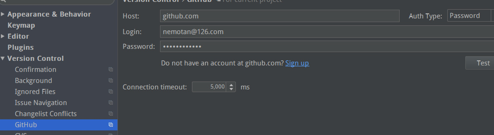
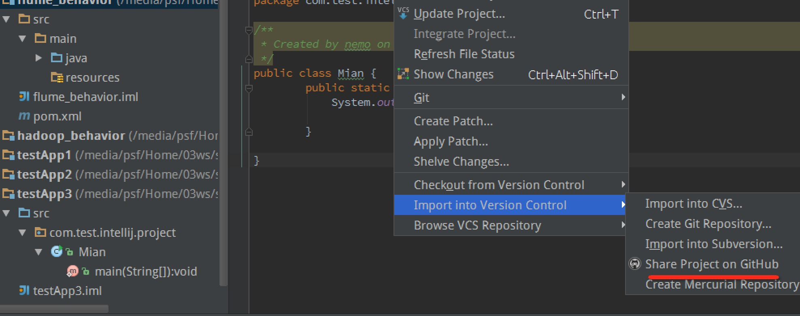

##安装intellij
直接去官网下载linux版本即可
##安装git
ubutun执行:
	
	安装：	
		apt-get install git
	配置：
		git config --global user.name "nemotan"
		git config --global user.email "nemotan@126.com"
		ssh-keygen -t rsa -C "nemotan@126.com"
		
进入到~/.ssh目录，发现id_rsa.pub文件，把里面的内容复制到gitthub官网的seeting下的ssh key进行添加。
##intellij idea git配置
1、File-->seegting-->Version Control-->GitHub,输入用户名和密码。

2、File-->seeting-->Version Control-->Git，这里的Path设置为ubutun下安装的git执行目录：我这里执行apt-get install git之后，会把git命令安装到/user/bin目录下。点击test会显示git的版本信息

3、单击module定位到module之后，点击VSC-->import into version control -->share project on GitHub 。之后输入respoitory name就可以把该module share到gitHub上了。

##另外附上：命令行提交到远程github
安装好git以后需要执行的命令如下：

	git init 初始化本地
	git add * 添加所有
	git commit -m "init"
	git remote add origin https://github.com/nemotan/test1.git  
	git push -u origin master

